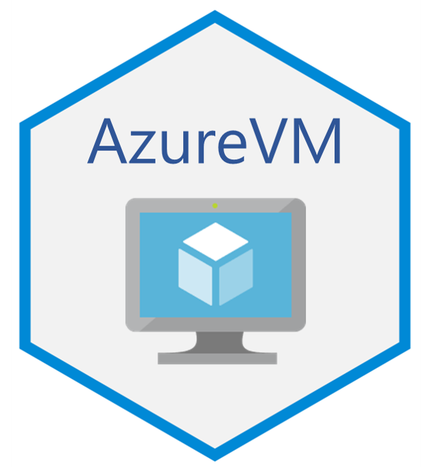

# AzureVM 

[](https://cran.r-project.org/package=AzureVM)

[](https://travis-ci.org/Azure/AzureVM)

AzureVM is a package for interacting with [virtual machines](https://azure.microsoft.com/services/virtual-machines/) and [virtual machine scalesets](https://azure.microsoft.com/services/virtual-machine-scale-sets/) in Azure. You can deploy, start up, shut down, run scripts, deallocate and delete VMs and scalesets from the R command line. It uses the tools provided by the [AzureRMR package](https://github.com/Azure/AzureRMR) to manage VM resources and templates. Version 2.0 of AzureVM is a complete rewrite of the package, aiming to make it a truly generic and flexible interface to VMs.

The primary repo for this package is at https://github.com/Azure/AzureVM; please submit issues and PRs there. It is also mirrored at the Cloudyr org at https://github.com/cloudyr/AzureVM. You can install the development version of the package with `devtools::install_github("Azure/AzureVM")`.


## Virtual machines

Here is a simple example. We create a VM using the default settings, run a shell command, resize the VM, and then delete it.

```r
library(AzureVM)

sub <- AzureRMR::get_azure_login()$
    get_subscription("sub_id")

# calling create_vm() from a subscription object will create the VM in its own resource group
# default is an Ubuntu 18.04 VM, size Standard_DS3_v2, login via SSH key
# call sub$list_vm_sizes() to get the sizes available in your region
vm <- sub$create_vm("myubuntuvm", user_config("myname", "~/.ssh/id_rsa.pub"),
                    location="australiaeast")

# run a shell script or command remotely (will be PowerShell on a Windows VM)
vm$run_script("echo hello world! > /tmp/hello.txt")

# ... and stop it
vm$stop()

# ... and resize it
vm$resize("Standard_DS4_v2")

# ... and delete it (this can be done asynchronously for a VM in its own group)
vm$delete()
```

AzureVM comes with a number of predefined configurations, for deploying commonly used VM images. For example, to create an Ubuntu [Data Science Virtual Machine](https://azure.microsoft.com/services/virtual-machines/data-science-virtual-machines/) accessible via SSH, JupyterHub and RStudio Server:

```r
sub$create_vm("mydsvm", user_config("myname", "~/.ssh/id_rsa.pub"), config="ubuntu_dsvm",
              location="australiaeast")
```
And to create a Windows Server 2019 VM, accessible via RDP:

```r
sub$create_vm("mywinvm", user_config("myname", password="Use-strong-passwords!"), config="windows_2019",
              location="australiaeast")
```

The available predefined configurations are `ubuntu_18.04` (the default), `ubuntu_16.04`, `ubuntu_dsvm`, `windows_2019`, `windows_2016`, `windows_dsvm`, `rhel_7.6`, `rhel_8`, `centos_7.5`, `centos_7.6`, `debian_8_backports` and `debian_9_backports`. You can combine these with several other arguments to customise the VM deployment to your needs:

- `size`: VM size. Use the `list_vm_sizes` method for the subscription and resource group classes to see the available sizes.
- `datadisks`: The data disk sizes/configurations to attach.
- `ip`: Public IP address. Set this to NULL if you don't want the VM to be accessible outside its subnet.
- `vnet`: Virtual network/subnet.
- `nsg`: Network security group. AzureVM will associate the NSG with the vnet/subnet, not with the VM's network interface.
- `nic`: Network interface.
- `other_resources`: Optionally, a list of other resources to deploy.

```r
# Windows Server 2016, with a 500GB datadisk attached, not publicly accessible
sub$create_vm("mywinvm2", user_config("myname", password="Use-strong-passwords!"),
              size="Standard_DS4_v2", config="windows_2016", datadisks=500, ip=NULL,
              location="australiaeast")

# Ubuntu DSVM, GPU-enabled
sub$create_vm("mydsvm", user_config("myname", "~/.ssh/id_rsa.pub"), size="Standard_NC12s_v2",
              config="ubuntu_dsvm",
              location="australiaeast")

# Red Hat VM, serving HTTP/HTTPS
sub$create_vm("myrhvm", user_config("myname", "~/.ssh/id_rsa.pub"), config="rhel_8",
              nsg=nsg_config(list(nsg_rule_allow_http, nsg_rule_allow_https)),
              location="australiaeast")
```

Full customisation is provided by the `vm_config` function, which also lets you specify the image to deploy, either from the marketplace or a disk. (The predefined configurations actually call `vm_config`, with the appropriate arguments for each specific config.)

```r
## custom VM configuration: Windows 10 Pro 1903 with data disks
## this assumes you have a valid Win10 desktop license
user <- user_config("myname", password="Use-strong-passwords!")
image <- image_config(
     publisher="MicrosoftWindowsDesktop",
     offer="Windows-10",
     sku="19h1-pro"
)
datadisks <- list(
    datadisk_config(250, type="Premium_LRS"),
    datadisk_config(1000, type="Standard_LRS")
)
nsg <- nsg_config(
    list(nsg_rule_allow_rdp)
)
sub$create_vm("mywin10vm", user,
    config=vm_config(
        image=image,
        keylogin=FALSE,
        datadisks=datadisks,
        nsg=nsg,
        properties=list(licenseType="Windows_Client")
    ),
    location="australiaeast"
)
```

## VM scalesets

The equivalent to `create_vm` for scalesets is the `create_vm_scaleset` method. By default, a new scaleset will come with a load balancer and autoscaler attached, but its instances will not be externally accessible.

```r
# default is Ubuntu 18.04 scaleset, size Standard_DS1_v2
sub$create_vm_scaleset("myubuntuss", user_config("myname", "~/.ssh/id_rsa.pub"), instances=5,
                       location="australiaeast")
```

Each predefined VM configuration has a corresponding scaleset configuration. To specify low-level scaleset options, use the `scaleset_options` function. Here are some sample scaleset deployments:

```r
# Windows Server 2019
sub$create_vm_scaleset("mywinss", user_config("myname", password="Use-strong-passwords!"), instances=5,
                       config="windows_2019",
                       location="australiaeast")

# RHEL scaleset, serving HTTP/HTTPS
sub$create_vm_scaleset("myrhelss", user_config("myname", "~/.ssh/id_rsa.pub"), instances=5,
                       config="rhel_8_ss",
                       nsg=nsg_config(list(nsg_rule_allow_http, nsg_rule_allow_https)),
                       location="australiaeast")

# Ubuntu DSVM, GPU-enabled, public instances, no load balancer or autoscaler
sub$create_vm_scaleset("mydsvmss", user_config("myname", "~/.ssh/id_rsa.pub"), instances=5,
                       size="Standard_NC6", config="ubuntu_dsvm_ss",
                       options=scaleset_options(public=TRUE),
                       load_balancer=NULL, autoscaler=NULL,
                       location="australiaeast")

# Large Debian scaleset (multiple placement groups), using low-priority VMs
# need to set the instance size to something that supports low-pri
sub$create_vm_scaleset("mylargess", user_config("myname", "~/.ssh/id_rsa.pub"), instances=10,
                       size="Standard_DS3_v2", config="debian_9_backports_ss",
                       options=scaleset_options(low_priority=TRUE, large_scaleset=TRUE),
                       location="australiaeast")
```

Working with scaleset instances can be tedious if you have a large scaleset, since R can only connect to one instance at a time. To solve this problem, AzureVM creates a pool of background processes that connect in parallel with the scaleset, leading to significant speedups. The pool is created automatically the first time it is needed, and is deleted at the end of the session.

```r
# this will create a pool of up to 10 processes that talk to the scaleset
mylargess$run_script("echo hello world! > /tmp/hello.txt")
```

You can control the size of the pool with the global `azure_vm_minpoolsize` and `azure_vm_maxpoolsize` options, which have default values 2 and 10 respectively. To turn off parallel connections, set `options(azure_vm_maxpoolsize=0)`. Note that the pool size is unrelated to the _scaleset_ size; it only controls how many instances can communicate with AzureVM simultaneously.

## Sharing resources

You can also include an existing Azure resource in a deployment, by supplying an AzureRMR `az_resource` object as an argument in the `create_vm` or `create_vm_scaleset` call. For example, here we create a VM and a scaleset that share a single virtual network/subnet.

```r
## VM and scaleset in the same resource group and virtual network
# first, create the resgroup
rg <- sub$create_resource_group("rgname", "australiaeast")

# create the master
rg$create_vm("mastervm", user_config("myname", "~/.ssh/id_rsa.pub"))

# get the vnet resource
vnet <- rg$get_resource(type="Microsoft.Network/virtualNetworks", name="mastervm-vnet")

# create the scaleset
# since the NSG is associated with the vnet, we don't need to create a new NSG either
rg$create_vm_scaleset("slavess", user_config("myname", "~/.ssh/id_rsa.pub"),
                      instances=5, vnet=vnet, nsg=NULL)
```

---
<p align="center"><a href="https://github.com/Azure/AzureR"></a></p>
